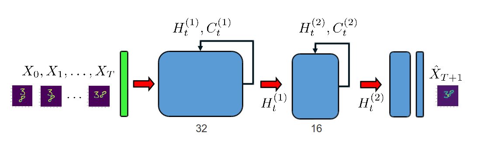
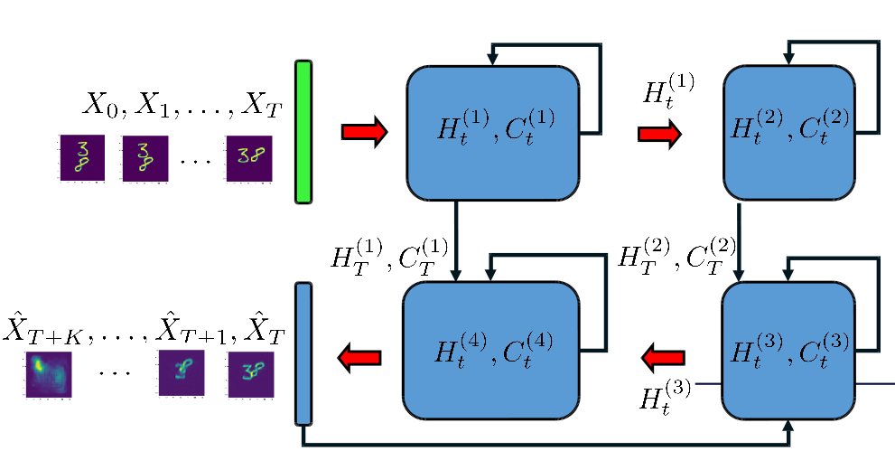

# convLSTM_movingMNIST
Uses convLSTM-cells to predict frames from the movingMNIST dataset. There are two models:

## Single-step model 
Encoder structure. Takes in a sequence of 19 movingMNIST frames and attemts to output 20th frame
 

## Multistep model
Encoder-decoder structure. Takes in a sequence of between 10 and 19 movingMNIST fames (sequence length selected at random for each batch) and attempts to output the remaining frames. The encoder was initialized with the weights from the single-step model during training (when trained from scratch the model did not converge).    
 


## Instructions
Clone repository
```
git clone https://github.com/Linusnie/convLSTM_movingMNIST.git
cd convLSTM_movingMNIST
```
download the moving mnist dataset:
```
wget http://www.cs.toronto.edu/~nitish/unsupervised_video/unsup_video_lstm.tar.gz
```

To run encoder network for single-step prediction:
```
python convlstm_onestep.py
```

To run endoder-decoder network for multistep prediction:
```
python convlstm.py
```

By default, pre-trained models are loaded from the `restore` folder. Example outputs are stored in the `images` folder
